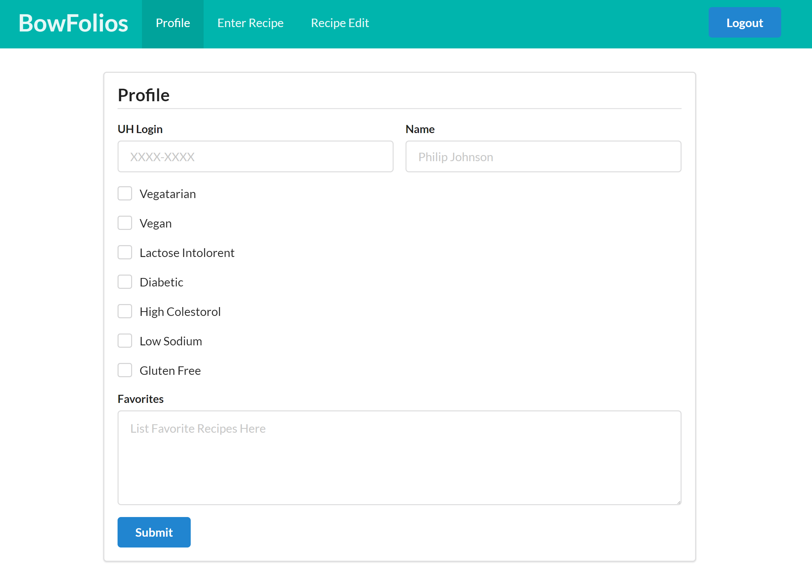
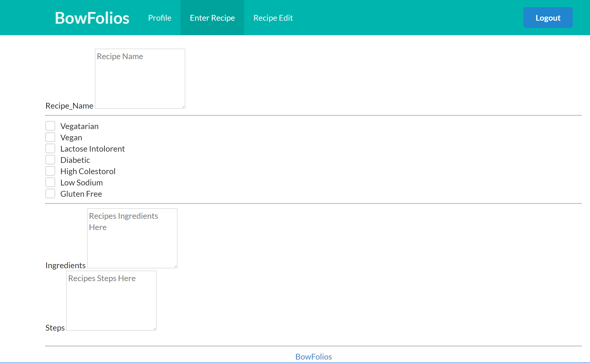
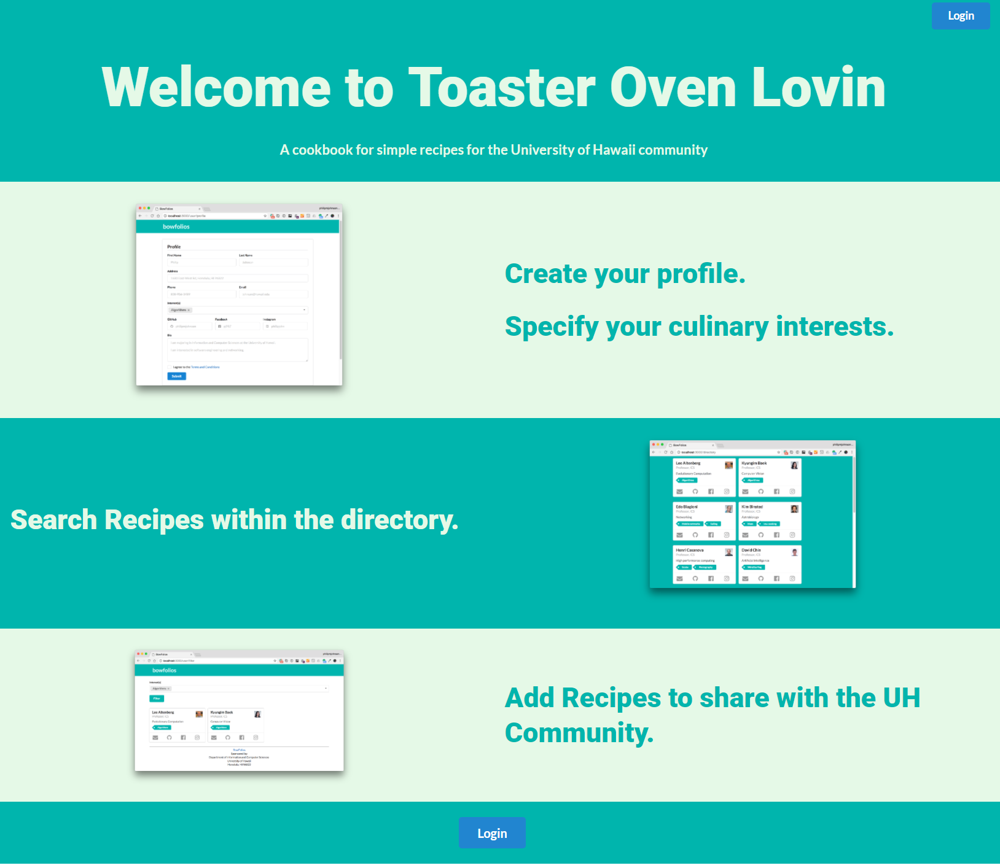

# final-project-mockup

Toster Oven Lovin

Pages Hierarchy:
&nbsp;&nbsp;Public Landing with Login 
&nbsp;&nbsp;&nbsp;&nbsp;User Home Page 
&nbsp;&nbsp;&nbsp;&nbsp;&nbsp;&nbsp;User Profile Page 
&nbsp;&nbsp;&nbsp;&nbsp;&nbsp;&nbsp;Search Recipe 
&nbsp;&nbsp;&nbsp;&nbsp;&nbsp;&nbsp;&nbsp;&nbsp;Display Recipe 
&nbsp;&nbsp;&nbsp;&nbsp;Add Recipe 
&nbsp;&nbsp;&nbsp;&nbsp;Edit  
&nbsp;&nbsp;Administrator Homepage 
&nbsp;&nbsp;&nbsp;&nbsp;Search Recipe 
&nbsp;&nbsp;&nbsp;&nbsp;&nbsp;&nbsp;Display Recipe 
&nbsp;&nbsp;&nbsp;&nbsp;Add Recipe 
&nbsp;&nbsp;&nbsp;&nbsp;About culinary 
  
Page Deisgn: 
&nbsp;&nbsp;Public Landing:&nbsp;&nbsp;Welcome/Introduction, About, Create New User, Existing User Login 
&nbsp;&nbsp;User Homepage:&nbsp;&nbsp;Welcome, Edit User Profile, Add Recipe, Search Recipe, Edit Recipe 
&nbsp;&nbsp;User Profile Page:&nbsp;&nbsp;Fields:  Student ID, User Name, Dietary Preference Check Boxes 
&nbsp;&nbsp;Search Recipe:&nbsp;&nbsp;Criteria (Dietary Preference), Cooking Time, Ingredients, Cooking Methods 
&nbsp;&nbsp;Display Recipe:&nbsp;&nbsp;Recipe Name, Ingredients, Cooking Time, Procedure 
&nbsp;&nbsp;Add Recipe:&nbsp;&nbsp;(Display Recipe w/ Submit Button which add login) 
&nbsp;&nbsp;Edit Recipe:&nbsp;&nbsp;(Login Validation, Display Recipe w/ Edit Button) 
&nbsp;&nbsp;Administrators Homepage:&nbsp;&nbsp;Search Recipe, Add Recipe, Edit Recipe, 
&nbsp;&nbsp;Administrators’ Edit Recipe:&nbsp;&nbsp;Edit Recipe with Delete Button) 
&nbsp;&nbsp;About:&nbsp;&nbsp;1 Paragraph about the Project. 
  

